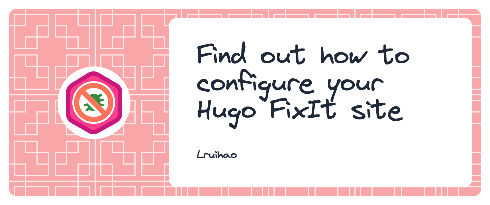

# Windows下使用Hugo与Github Pages部署博客网站


由于笔者太懒,加之本文主要是为方便回顾流程所写,只会在一些笔者遇到的问题上详细说明,不会像参考链接中的大多数博客那样详细,orz

&lt;!--more--&gt; 

## 1.Hugo环境搭建
建议选择Hugo.Extended
### 1.1前置准备
参见[Installation on Windows](https://gohugo.io/installation/windows/), 需要Git，Go，Dart Sass环境


### 1.2常用命令
使用`hugo version`命令查看是否安装成功

#### 1.2.1新建一个网站

```bash
hugo new your-site-name
```

#### 1.2.2新建一个post

```bash
hugo new content posts/my-first-post.md
```

这将会根据/arcthetypes/下的模板(默认为default.md)生成md文件
    
#### 1.2.3本地调试
```bash
hugo server -D
```
`-D`会将草稿也渲染
#### 1.2.4发布
```bash
hugo 
```
在`site`根目录下生成`public`文件夹


## 2.主题
本文使用的是[FixIt](https://github.com/hugo-fixit/FixIt)

### 2.1FixIt安装
将主题文件夹放于`/themes/`下即可,一般方法如下
- git clone
- git submodule
- hugo module

### 2.2配置
应用主题需要设置hugo.toml的`theme`字段即可

一般主题都会有一个模板配置文件(夹),参考[Hugo Configuration](https://gohugo.io/getting-started/configuration/)和[配置FixIt](https://fixit.lruihao.cn/zh-cn/documentation/getting-started/configuration/)


## 3.GitHub Pages部署
参见[Pages](https://pages.github.com/)

### 3.1Pages仓库
主要是仓库名应为`owner-name.github.io`

将`public`下的内容上传到该仓库,即可通过`https://owner&#39;s-name.github.io`访问


## 4.GitHub Actions自动化部署
由于Pages库的可见性与网站可访问性一致.

所以在不希望公开源码的情况下,源码库和发布库可以分离,通过`Github Actions`实现.

### 4.1工作流
在网站目录下创建`.github/workflows/hugo.yaml`.

修改`env`中的个人信息, 再注意一下`HUGO_VERSION`.
```yaml
name: Deploy Hugo site to Pages

on:
  push:
    branches:
      - main
  workflow_dispatch:

permissions:
  contents: write

env:
  # 推送目标仓库 格式 用户名/仓库名
  TARGET_REPOSITORY_NAME: fengjin2333/fengjin2333.github.io
  # 同步临时目录
  CLONE_DIR: tmp_public
  # 构建临时目录
  BUILD_DIR: public
  # 配置 Git 用户名
  GIT_USERNAME: fengjin2333
  # 配置 Git 邮箱
  GIT_EMAIL: feng_jin233@outlook.com

jobs:
  build-and-deploy:
    runs-on: ubuntu-latest
    env:
      HUGO_VERSION: 0.141.0
    steps:
      # 步骤 1: 安装 Hugo CLI
      - name: Install Hugo CLI
        run: |
          wget -O ${{ runner.temp }}/hugo.deb https://github.com/gohugoio/hugo/releases/download/v${HUGO_VERSION}/hugo_extended_${HUGO_VERSION}_linux-amd64.deb \
          &amp;&amp; sudo dpkg -i ${{ runner.temp }}/hugo.deb

      # 步骤 2: 安装 Dart Sass
      - name: Install Dart Sass
        run: sudo snap install dart-sass

      # 步骤 3: 检出源码仓库
      - name: Checkout
        uses: actions/checkout@v4
        with:
          submodules: recursive
          fetch-depth: 0

      # 步骤 4: 使用 Hugo 构建站点
      - name: Build with Hugo
        env:
          HUGO_CACHEDIR: ${{ runner.temp }}/hugo_cache
          HUGO_ENVIRONMENT: production
          TZ: America/Los_Angeles
        run: |
          hugo \
            --gc \
            --minify \
            --destination ${{ env.BUILD_DIR }}

      # 步骤 5: 配置 Git 用户信息
      - name: Git Config
        run: |
          git config --global user.email &#34;${{ env.GIT_EMAIL }}&#34;
          git config --global user.name &#34;${{ env.GIT_USERNAME }}&#34;

      # 步骤 6: 克隆 Pages 仓库
      - name: Clone Pages repository
        run: |
          git clone --depth 1 https://${{ secrets.DEPLOYHUGO }}@github.com/${{ env.TARGET_REPOSITORY_NAME }}.git ${{ env.CLONE_DIR }}

      # 步骤 7: 清空目标目录并复制构建结果
      - name: Copy build output to Pages repository
        run: |
          rm -rf ${{ env.CLONE_DIR }}/*
          cp -rf ${{ env.BUILD_DIR }}/* ${{ env.CLONE_DIR }}/
          cd ${{ env.CLONE_DIR }}
          echo &#34;${{ github.event.head_commit.message }} `date &#43;%FT%T%z`&#34; &gt; _pub_time.html

      # 步骤 8: 提交并推送更改到 Pages 仓库
      - name: Commit and push changes
        run: |
          cd ${{ env.CLONE_DIR }}
          git add .
          git commit --message &#34;Update from source repository: ${{ github.event.head_commit.message }}&#34;
          git push -f -q https://${{ secrets.DEPLOYHUGO }}@github.com/${{ env.TARGET_REPOSITORY_NAME }}.git main
```
### 4.2Token
由于我们需要操作另一个`repo`, 因此需要在源码仓库配置`Token`, 参见[自动部署](https://blog.baicai.me/article/2023/hugo_github_action_blog/).

注意替换

`https://${{ secrets.DEPLOYHUGO }}@github.com/${{ env.TARGET_REPOSITORY_NAME }}.git`

中的`DEPLOYHUGO`为`Token`名称.


## 5.自定义网站

### 5.1文章模板
Hugo中有[Front Matter](https://gohugo.io/content-management/front-matter/)这个概念,用于设置文章的创建(编辑)日期,标签,标题,合集等,和配置文件一样,可以使用`toml`,`yaml`,`json`格式,一般放在`.md`文件开头.

在`Front Matter`里还可以使用[Shortcodes](https://gohugo.io/content-management/shortcodes/),功能类似函数,可用于获取当前时间,文件名,网站名等.

为避免每次都手动编写,在`/archtypes/`下创建模板文件可以在`hugo new`时自动生成,根据文章类型有一套查找模板的逻辑,参见[Archtypes](https://gohugo.io/content-management/archetypes/).


### 5.2编辑网站菜单栏
hugo支持三种修改菜单的方式,详情参考[Menus](https://gohugo.io/content-management/menus/).

- hugo.toml

- define automatically

- front matter

本文采用第一种,修改`hugo.toml`中的[menu]部分.

```toml
[menu]
  [[menu.main]]
    identifier = &#34;posts&#34;
    parent = &#34;&#34;
    # you can add extra information before the name (HTML format is supported), such as icons
    pre = &#34;&#34;
    # you can add extra information after the name (HTML format is supported), such as icons
    post = &#34;&#34;
    name = &#34;文章&#34;
    pageRef = &#34;/posts/&#34;
    # title will be shown when you hover on this menu link
    title = &#34;&#34;
    weight = 1
    # FixIt 0.2.14 | NEW add user-defined content to menu items
    [menu.main.params]
      # add css class to a specific menu item
      class = &#34;&#34;
      # whether set as a draft menu item whose function is similar to a draft post/page
      draft = false
      # FixIt 0.2.16 | NEW add fontawesome icon to a specific menu item
      icon = &#34;fa-solid fa-archive&#34;
      # FixIt 0.2.16 | NEW set menu item type, optional values: [&#34;mobile&#34;, &#34;desktop&#34;]
      type = &#34;&#34;
      # FixIt 0.3.9 | NEW whether to show the submenu item divider line
      divided = false
  [[menu.main]]
    identifier = &#34;categories&#34;
    parent = &#34;posts&#34;
    pre = &#34;&#34;
    post = &#34;&#34;
    name = &#34;分类&#34;
    pageRef = &#34;/categories&#34;
    title = &#34;&#34;
    weight = 2
    [menu.main.params]
      icon = &#34;fa-solid fa-folder-tree&#34;
  [[menu.main]]
    identifier = &#34;tags&#34;
    parent = &#34;posts&#34;
    pre = &#34;&#34;
    post = &#34;&#34;
    name = &#34;标签&#34;
    pageRef = &#34;/tags&#34;
    title = &#34;&#34;
    weight = 3
    [menu.main.params]
      icon = &#34;fa-solid fa-tags&#34;
  [[menu.main]]
    identifier = &#34;collections&#34;
    parent = &#34;posts&#34;
    pre = &#34;&#34;
    post = &#34;&#34;
    name = &#34;集合&#34;
    pageRef = &#34;/collections&#34;
    title = &#34;&#34;
    weight = 2
    [menu.main.params]
      icon = &#34;fa-solid fa-layer-group&#34;
  [[menu.main]]
    identifier = &#34;questbook&#34;
    parent = &#34;&#34;
    pre = &#34;&#34;
    post = &#34;&#34;
    name = &#34;留言&#34;
    pageRef = &#34;/&#34;
    title = &#34;&#34;
    weight = 2
    [menu.main.params]
      icon = &#34;fa-solid fa-comments&#34;      
  [[menu.main]]
    identifier = &#34;friends&#34;
    parent = &#34;&#34;
    pre = &#34;&#34;
    post = &#34;&#34;
    name = &#34;友链&#34;
    pageRef = &#34;/&#34;
    title = &#34;&#34;
    weight = 2
    [menu.main.params]
      icon = &#34;fa-solid fa-thumbs-up&#34;
```

注意以下几个字段:

- `parent`:指定父级菜单

- `pageRef`:指定相对于/content/的路径, 如`/tags`

- `name`:页面显示的名称

可以使用hugo的分类机制[Taxonomies](https://gohugo.io/content-management/taxonomies/)

在`hugo.toml`中设置的分类, 可以在文章的`front matter`中应用, 同时在发布时会自动生成对应的文件夹, 因此`[menu]`中可以设置对应的`pageRef`.

```toml
[taxonomies]
  category = &#34;categories&#34;
  tag = &#34;tags&#34;
  collection = &#34;collections&#34;
```

## 6.插入图片

### 6.1存储方式

- /static/

- page bundle

#### 6.1.1/static

将图片存放在`/static`下, 发布时就会存放到`/public`下

但是这要求路径为`/img.png`, 无法在编辑器下查看

#### 6.1.2page bundle
参考[Image processing](https://gohugo.io/content-management/image-processing/)

建立Page bundle, 将图片作为Page Resource存放

以该文章文件夹为根目录, 通过`img.png`即可引用




### 6.2尺寸和布局


## 参考链接
[Windows下使用hugo和Github Pages配置博客](https://www.haoyep.com/posts/windows-hugo-blog-github/)

[使用hugo搭建博客网站](https://tingxuanr.github.io/note/%E4%BD%BF%E7%94%A8hugo%E6%90%AD%E5%BB%BA%E5%8D%9A%E5%AE%A2%E7%BD%91%E7%AB%99/)

[手把手学习 Hugo 博客的搭建:从入门到进阶](https://blog.eimoon.com/p/learn-hugo-blog-building-from-beginner-to-advanced/)

[如何利用 GitHub Pages 和 Hugo 轻松搭建个人博客？](https://zhuanlan.zhihu.com/p/57361697)

[Hugo &#43; GitHub Action &#43; Github Pages，搭建博客自动发布](https://blog.baicai.me/article/2023/hugo_github_action_blog/)

[Hugo 引用图片](https://wangloo.github.io/posts/hugo/hugo_image/)

[FixIt主题](https://fixit.lruihao.cn/zh-cn/)

[Hugo](https://gohugo.io/)


---

> 作者: Kissy  
> URL: https://fengjin2333.github.io/posts/windows%E4%B8%8B%E4%BD%BF%E7%94%A8hugo%E4%B8%8Egithub-pages%E9%83%A8%E7%BD%B2%E5%8D%9A%E5%AE%A2%E7%BD%91%E7%AB%99/  

